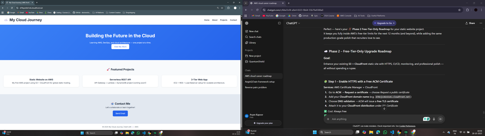

# ☁️ AWS Static Website Deployment – Phase 1 & 2



---

## 🧭 Project Overview

This project demonstrates how to deploy a **static website on AWS** using **Amazon S3**, **CloudFront**, and **GitHub Actions CI/CD**.
It is part of my hands-on AWS learning path toward becoming a **Cloud Engineer / DevOps Engineer**.

---

## 🚀 Features Implemented

### **Phase 1 – Static Website Hosting**

* Hosted HTML/CSS/JS website in **Amazon S3**
* Enabled **Static Website Hosting**
* Set proper **Bucket Policy** for public read access
* Verified via S3 website endpoint
  → `http://my-first-aws-site-aryan.s3-website-us-east-1.amazonaws.com/`

### **Phase 2 – Global Distribution + Automation**

* Added **Amazon CloudFront CDN** in front of S3 for:

  * Faster global delivery
  * HTTPS + SSL encryption (via ACM)
* Configured **GitHub Actions** for automatic deployment:

  * On every push to `main` branch
  * Syncs repo files to S3
  * Automatically **invalidates CloudFront cache**
* Created a dedicated **IAM user** for GitHub Actions with:

  * `AmazonS3FullAccess`
  * `AmazonCloudFrontFullAccess`
* Stored credentials securely as **GitHub Secrets**

---

## 🧩 Architecture Diagram

```
Developer (GitHub)
      |
      |  Push to main branch
      ▼
GitHub Actions (CI/CD)
      |
      |  AWS Credentials (IAM User)
      ▼
Amazon S3 (Static Website)
      |
      |  Origin
      ▼
Amazon CloudFront (Global CDN)
      |
      ▼
End User (Browser)
```

---

## ⚙️ Deployment Pipeline Details

| Step | Description                                |
| ---- | ------------------------------------------ |
| 1️⃣  | Commit & push code to GitHub               |
| 2️⃣  | GitHub Actions workflow runs automatically |
| 3️⃣  | Files synced to S3 bucket                  |
| 4️⃣  | CloudFront cache invalidated               |
| 5️⃣  | Updated site instantly available worldwide |

---

## 🛡️ Security & Access Management

* Least-privilege IAM user created specifically for CI/CD
* AWS credentials **never hardcoded** in codebase
* Secrets stored in GitHub > Settings > Secrets > Actions
* HTTPS enabled through **AWS Certificate Manager (ACM)**

---

## 📈 Current Architecture Components

| AWS Service                       | Purpose                           |
| --------------------------------- | --------------------------------- |
| **Amazon S3**                     | Static website hosting            |
| **Amazon CloudFront**             | Global CDN and HTTPS              |
| **AWS IAM**                       | Access control for GitHub Actions |
| **GitHub Actions**                | Continuous deployment automation  |
| **AWS Certificate Manager (ACM)** | SSL/TLS certificate (in progress) |

---

## 🧠 Learnings & Outcomes

* Understood S3 bucket policies and public access controls
* Practiced IAM roles, access keys, and secrets management
* Gained hands-on experience with CloudFront distribution setup
* Implemented real-world CI/CD with GitHub Actions
* Built foundational AWS project for cloud portfolio

---

## 🏗️ Next Phase – Monitoring & Security

Coming soon (Phase 3):

* **CloudWatch Metrics & Alarms** for uptime/error monitoring
* **AWS Budgets** for cost tracking
* Optional: **WAF demo** to test basic security filters
* HTTPS Certificate activation (ACM)

---

## 📚 Technologies Used

* **AWS S3**
* **AWS CloudFront**
* **AWS IAM**
* **AWS Certificate Manager**
* **GitHub Actions**
* **HTML / CSS / JavaScript**

---

## 👨‍💻 Author

**Aryan Kapoor**
Cloud Computing Student | AWS Learner | Aspiring Cloud/DevOps Engineer

Connect: [LinkedIn Profile (Coming Soon)](https://www.linkedin.com/)
