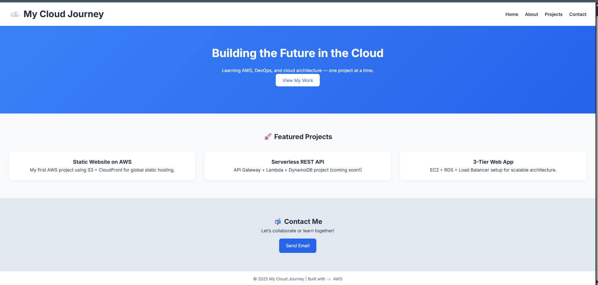

# ☁️ AWS Cloud Static Website Project

### 🚀 Project Overview

This project demonstrates how to **deploy, secure, and automate a static website using AWS services** — all within the AWS Free Tier.
It showcases a complete DevOps-style workflow, from hosting and caching to CI/CD automation and security hardening.

---

## 📂 Folder Structure

```
.
├── index.html
├── style.css
├── 404.html
├── 403.html
├── Screen.png
├── Screenshot.png
├── Metrics.png
└── README.md
```

---

## 🧩 Technologies Used

* **Amazon S3** — Website hosting + versioning
* **AWS CloudFront** — Global CDN caching + HTTPS
* **AWS Certificate Manager** — SSL/TLS certificate for HTTPS
* **AWS IAM** — GitHub Actions deployment user with restricted permissions
* **GitHub Actions** — Automated CI/CD pipeline to S3 + CloudFront
* **Amazon CloudWatch** — Monitoring & alarms for distribution health
* **AWS Cost Explorer (Free Tier)** — Budget tracking
* **AWS Response Headers Policy** — Security hardening via HTTP headers

---

## 🏗️ Phase-by-Phase Breakdown

### **Phase 1 – S3 Static Website Hosting**

* [x] Created an S3 bucket (`my-first-aws-site-aryan`)
* [x] Uploaded website files (`index.html`, `style.css`)
* [x] Configured static website hosting and tested public access
* [x] Verified via:
  `http://my-first-aws-site-aryan.s3-website-us-east-1.amazonaws.com`

---

### **Phase 2 – CloudFront CDN Integration**

* [x] Connected S3 bucket to CloudFront for faster, secure global delivery
* [x] Configured caching behavior and automatic invalidation
* [x] Deployed the distribution successfully
* [x] Final CloudFront URL:
  `https://d78vjzv8z61e6.cloudfront.net`

---

### **Phase 3 – Monitoring and Logging**

* [x] Enabled **S3 access logs** → separate logging bucket
* [x] Configured **CloudFront access logs** for request tracking
* [x] Set up **CloudWatch metrics and alarms** for status checks
* [x] Email alerts enabled via SNS subscription
* [x] Pinned CloudFront & CloudWatch to AWS Console favorites

📸 *Metrics Screenshot:*


---

### **Phase 4 – CI/CD Pipeline Integration**

* [x] Created a dedicated IAM user (`github-deploy-user`) with minimal permissions
* [x] Added AWS credentials as GitHub Secrets
* [x] Automated website deployment via GitHub Actions on every push to `main`
* [x] Automatic CloudFront invalidation for new updates

**GitHub Actions workflow (`.github/workflows/deploy.yml`):**

```yaml
name: Deploy to S3 + CloudFront

on:
  push:
    branches:
      - main

jobs:
  deploy:
    runs-on: ubuntu-latest
    steps:
      - name: Checkout repository
        uses: actions/checkout@v4

      - name: Configure AWS credentials
        uses: aws-actions/configure-aws-credentials@v4
        with:
          aws-access-key-id: ${{ secrets.AWS_ACCESS_KEY }}
          aws-secret-access-key: ${{ secrets.AWS_SECRET_KEY }}
          aws-region: us-east-1

      - name: Sync files to S3
        run: |
          aws s3 sync . s3://my-first-aws-site-aryan --delete --exclude ".git/*" --exclude ".github/*"

      - name: Create CloudFront cache invalidation
        run: |
          aws cloudfront create-invalidation \
            --distribution-id E1IV4CZ586FDEG \
            --paths "/*"
```


---

### **Phase 5 – Security, Error Handling & Optimization**

* [x] Created custom **403.html** and **404.html** error pages
* [x] Configured CloudFront to use these pages for friendly responses
* [x] Added a **custom Response Headers Policy** for enhanced security:

  * `Strict-Transport-Security: max-age=63072000; includeSubDomains; preload`
  * `X-Frame-Options: DENY`
  * `X-Content-Type-Options: nosniff`
  * `Referrer-Policy: same-origin`
  * `Permissions-Policy: geolocation=(), microphone=(), camera=()`
  * `Content-Security-Policy: default-src 'self';`
* [x] Verified via browser network tab → headers applied correctly

📸 *Security Screenshot:*


---

## 🌍 Live Deployment

**Current Website URL:**
`https://d78vjzv8z61e6.cloudfront.net`

---

## 💡 Key Learnings

* Hosting static websites with **S3 + CloudFront** is simple yet powerful.
* Automating deployment pipelines with **GitHub Actions** improves workflow efficiency.
* CloudWatch monitoring ensures visibility, and proper IAM policies enhance security.
* Response header policies and error customization make a project feel production-ready.

---

## 🚀 Future Enhancements

* [ ] Add a **custom domain** via Route 53
* [ ] Implement **Lambda@Edge or CloudFront Functions** for lightweight logic
* [ ] Integrate **AWS WAF** for web attack filtering
* [ ] Add **cost alerts** via AWS Budgets for production scaling

---

## 🧠 Author

**Aryan Kapoor**
AWS Cloud Foundations Project (Free Tier Version)
